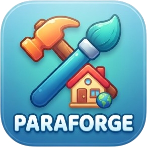
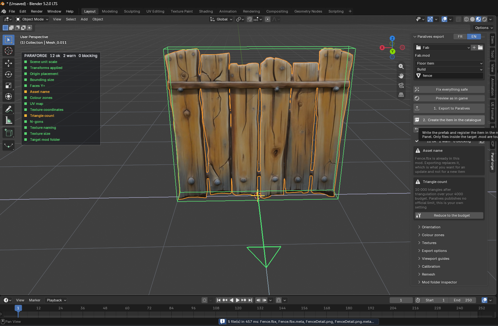
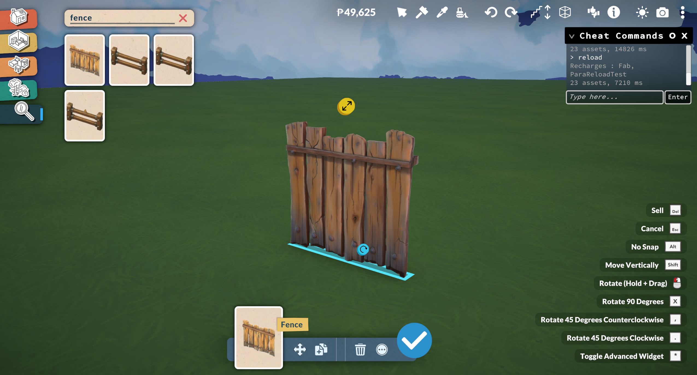

<p align="center">
  
</p>

<h1 align="center">ParaForge</h1>

<p align="center">
  <strong>Un modèle 3D de Blender au catalogue Build Mode de Paralives, en deux clics.</strong>
</p>

<p align="center">
  <a href="README.md">English</a> &nbsp;·&nbsp; <a href="README.fr.md">Français</a>
</p>

<p align="center">
  <a href="LICENSE"></a>
  
  <a href="../../actions/workflows/ci.yml"></a>
  <a href="../../releases/latest"></a>
</p>

---

ParaForge est une extension Blender pour [Paralives](https://store.steampowered.com/app/1118520/Paralives/).
Elle contrôle le mesh contre chaque règle du jeu, corrige ce qui peut l'être,
reconstruit les textures dans les cartes que le jeu lit vraiment, écrit le FBX
et ses PNG directement dans un dossier `.mod`, puis déclare l'objet dans le
catalogue du Build Mode.

Le jeu n'a jamais besoin d'être lancé, et aucun fichier de l'installation n'est
touché.

Interface en **français par défaut**, anglais au choix, réglable depuis
l'en-tête du panneau.

Blender 4.2 ou plus. Développée et testée sur Blender 5.2 LTS.

---

## Captures d'écran

<p align="center">
  
  <br>
  <em>Panneau ParaForge dans Blender 5.2 affichant la checklist automatisée, les règles de validation et les outils d'export.</em>
</p>

<br>

<p align="center">
  
  <br>
  <em>Objet 3D personnalisé exporté et posé en jeu dans le mode Construction de Paralives avec la console de rechargement.</em>
</p>

---

## Sommaire

- [Captures d'écran](#captures-décran)
- [Pourquoi cet outil](#pourquoi-cet-outil)
- [Installation](#installation)
- [Utilisation](#utilisation)
- [Ce que la checklist vérifie](#ce-que-la-checklist-vérifie)
- [Zones de couleur, trois entrées](#zones-de-couleur-trois-entrées)
- [Textures, et le nommage qui les configure](#textures-et-le-nommage-qui-les-configure)
- [Un GLB téléchargé, converti tout seul](#un-glb-téléchargé-converti-tout-seul)
- [Écrire l'objet sans passer par le Control Panel](#écrire-lobjet-sans-passer-par-le-control-panel)
- [Ce que le wiki ne dit pas, et que le jeu dit](#ce-que-le-wiki-ne-dit-pas-et-que-le-jeu-dit)
- [Annulation et sécurité](#annulation-et-sécurité)
- [Calibrage](#calibrage)
- [Limites](#limites)
- [Compiler depuis les sources](#compiler-depuis-les-sources)
- [Tests](#tests)
- [Organisation du projet](#organisation-du-projet)
- [Crédits et licence](#crédits-et-licence)

---

## Pourquoi cet outil

Paralives livre de vrais outils de modding dans le jeu, et ils fonctionnent. Ce
qu'ils ne font pas, c'est t'empêcher de te tromper sur le mesh. Le chemin
officiel : exporter depuis Blender, déposer les fichiers dans un dossier de
mod, relancer le jeu, ouvrir le Control Panel, créer un Item, créer un Prefab,
ajouter un `ItemMeshReference`, choisir le mesh, caler la bounding box,
assigner une surface, poser un tag, choisir un swatch group, puis découvrir si
l'orientation, l'échelle, l'origine et les rôles de texture étaient bons.

Chaque erreur coûte un redémarrage complet, puisque le jeu importe ses assets
au lancement et n'a aucun rechargement à chaud.

ParaForge déplace toute la vérification dans Blender, où une erreur ne coûte
rien, puis écrit elle-même l'entrée de catalogue pour faire disparaître la
passe Control Panel.

## Installation

Télécharge `paraforge-x.y.z.zip` depuis la [page des versions](../../releases/latest),
puis dans Blender :

**Edit > Preferences > Get Extensions > Install from Disk**, et choisis le zip.

Le panneau apparaît dans la barre latérale de la vue 3D, onglet **ParaForge**.
Touche `N` pour ouvrir la barre latérale.

## Utilisation

0. **Choisir le mod cible**, ou en créer un avec le `+` à côté du sélecteur.
   Les mods vivent dans `%USERPROFILE%\AppData\LocalLow\Paralives\Paralives\`.
   Évite `Local.mod` : c'est le bac à sable du jeu, pratique pour essayer, mais
   il ne peut pas être publié sur le Workshop.
1. **Sélectionner le mesh.** La checklist s'affiche dans le panneau et en
   surimpression dans la vue.
2. **Tout corriger sans risque** règle l'échelle, les transformations,
   l'origine, l'attribut de couleur et les rôles de texture.
3. **Vérifier l'orientation** contre la flèche verte, puis confirmer. C'est la
   seule chose qu'aucun outil ne peut deviner à ta place.
4. **1. Exporter vers Paralives** écrit le mesh et les textures.
5. **2. Créer l'objet dans le catalogue** déclare l'objet.

Les deux étapes sont nécessaires. Sans la seconde, les fichiers sont bien dans
le mod et rien n'apparaît en Build Mode.

Ensuite, relancer Paralives. Il n'y a pas de rechargement à chaud.

## Ce que la checklist vérifie

Chaque ligne est verte, orange ou rouge, avec la raison, et un bouton qui
corrige quand une correction existe.

| Contrôle | Ce que ça veut dire |
|---|---|
| Échelle de la scène | Paralives travaille en mètres à l'échelle 1.0 |
| Transformations appliquées | Rotation et échelle cuites, sinon l'objet arrive faux |
| Placement de l'origine | Selon le type d'objet, voir ci-dessous |
| Taille englobante | Contrôle de bon sens contre la taille d'une tuile |
| Tourné vers Y+ | Manuel, comparé à la flèche dessinée dans la vue |
| Zones de couleur | Uniquement les couleurs légales, quatre au maximum |
| Carte UV | Présente, et UV2 signalée quand elle est là |
| Coordonnées de texture | Un nœud Mapping est cuit dans les UV exportées, un FBX ne sachant pas le porter |
| Nombre de triangles | Contre ton propre budget, avec un bouton de décimation |
| N-gons | Ils sont triangulés à l'export et peuvent mal ombrer |
| Nommage des textures | Chaque image classée dans un rôle que le jeu connaît |
| Taille des textures | Rien dans le jeu ne dépasse 2K |
| Dossier mod cible | Existe, finit par `.mod`, et n'est pas dans le jeu |

Règles d'origine, tirées du wiki :

| Type d'objet | Règle |
|---|---|
| Objet au sol | Centré en X et Y, base à Z=0 |
| Objet mural | Centré en X et Z, dos à Y=0 |
| Fenêtre ou porte | Centré sur les trois axes |

## Zones de couleur, trois entrées

Paralives lit jusqu'à quatre zones recolorables dans les vertex colors, plus le
jaune du décalque. Les peindre à la main est lent, et un asset venu d'une
marketplace ou d'un générateur n'en a aucune.

1. **Sélectionner des faces, cliquer une zone.** L'évidente, avec des boutons
   colorés.
2. **Un matériau par zone.** La plupart des assets importés sont déjà découpés
   ainsi, les slots se transposent directement en zones.
3. **Prélever une couleur sur le modèle, puis l'étendre par tolérance.** C'est
   celle qui sauve un asset dont la seule texture est un bake unique. La
   pipette échantillonne la texture par un lancer de rayon plutôt que les pixels
   de l'écran, donc l'éclairage de la vue ne fausse jamais le résultat, et le
   curseur de tolérance est vivant dans le panneau de reprise.

Les couleurs légales sont exactes, et le jeu ne lit rien d'autre :

| Zone | Couleur |
|---|---|
| 0 | blanc `1, 1, 1` |
| 1 | rouge `1, 0, 0` |
| 2 | vert `0, 1, 0` |
| 3 | bleu `0, 0, 1` |
| Décalque | jaune `1, 1, 0`, jamais recolorable |

## Textures, et le nommage qui les configure

Le suffixe du nom de fichier est ce qui fait assigner les bons réglages
d'import par le jeu. Le réussir supprime une passe de configuration manuelle
par texture, et c'est le plus gros gain de toute la pipeline.

| Suffixe | Contenu | Note |
|---|---|---|
| `GrayMask` | Base recolorable, le gris 50 % est la teinte neutre | sRGB |
| `Detail` | Couleur libre, non recolorable | une seule par objet |
| `NormalOcclusion` | Normal map en **RGB**, occlusion dans l'**alpha** | données |
| `Smoothness` | **Blanc = brillant**, noir = mat | données |
| `ColorZone` | Carte de zones, pour les meshes sans vertex paint | données |
| `Master` | Murs et sols : R GrayMask, G variante, B HueShift | sRGB |

ParaForge écrit aussi le fichier `.meta` compagnon de chaque asset, qui porte
son GUID et ses drapeaux d'import, ce qui rend l'import déterministe au lieu de
dépendre de la lecture du nom par le jeu.

## Un GLB téléchargé, converti tout seul

Un modèle pris sur le web n'arrive jamais au bon format. glTF donne de la
*roughness* là où le jeu veut de la *smoothness*, empaquette l'occlusion dans
le rouge d'une texture ORM, et gltfpack efface les noms d'images, si bien que
Blender les appelle `Image_0`, `Image_1`, `Image_2`.

ParaForge identifie chaque image par trois sources d'indices, la plus fiable
d'abord :

1. **le graphe de shader**, c'est-à-dire ce à quoi l'image est branchée. C'est
   un fait, pas une supposition, et c'est le seul indice quand les noms ont
   disparu ;
2. **le nom de fichier** : `_Diffuse`, `-ORM`, `_Normal`, `_BaseColor` ;
3. **les pixels** : une normal map est reconnaissable, et une texture sans
   couleur n'est jamais un albédo.

Puis elle reconstruit :

```
baseColor            -> Detail (copie exacte) ou GrayMask (désaturé, recentré sur 50 %)
normal + occlusion   -> NormalOcclusion (RGB + alpha)
roughness            -> Smoothness (1 - roughness)
metallic             -> pas de canal, reversé en brillance
emissive             -> pas de canal, réintégré dans la couleur
```

Rien n'est deviné : une image que rien n'identifie reste marquée inconnue et
n'est pas écrite, plutôt que de poser la mauvaise carte dans le mod de
quelqu'un.

### Assets à plusieurs matériaux

Paralives donne **une surface par mesh**. Un asset découpé en cinq matériaux ne
s'importe donc pas tel quel. **Fusionner en une seule surface** repaquette les
UV de toute la sélection dans un atlas, bake chaque canal, et remplace les
matériaux par un seul. Le rendu est préservé, les UV non.

## Écrire l'objet sans passer par le Control Panel

Un objet Paralives, c'est trois morceaux de texte, tous **dans ton propre mod** :

```
<Mod>/<Nom>.prefab                  l'arbre d'objets, sa taille, son mesh
<Mod>/Settings/Items.setting        l'entrée de catalogue et son tag
<Mod>/Settings/Translations.setting le libellé que le joueur lit
```

Un mod ne porte que ce qu'il ajoute et le jeu fusionne le tout : le mod de
traduction française du jeu ne contient rien d'autre qu'un
`Translations.setting`. C'est pourquoi **aucun fichier du jeu n'est modifié**.

La fusion se fait sur le texte, pas en régénérant le fichier depuis un modèle
analysé : un `Items.setting` écrit par le jeu peut contenir des champs que
l'extension ne connaît pas, et les réécrire les perdrait en silence.

## Ce que le wiki ne dit pas, et que le jeu dit

Paralives livre son propre contenu sous forme de mod : `Main.mod`, dans le
dossier d'installation, est un dossier ordinaire de FBX, de PNG et de texte.
Tous les chiffres ci-dessous y ont été mesurés, jamais supposés. C'est la
partie du projet la plus susceptible de servir à d'autres outils.

### Le mesh doit être en centimètres

Le jeu multiplie les coordonnées brutes d'un FBX par 0,01. Il ignore à la fois
l'unité déclarée par le fichier et l'échelle portée par le nœud : un mesh écrit
en mètres arrive cent fois trop petit. Présent, bien placé, avec la bonne
emprise au sol, et beaucoup trop petit pour être vu.

Lu dans les fichiers `.import`, qui sont ce que le jeu a fait de chaque FBX :

| Mesh | Taille dans son prefab | Coordonnées dans l'import |
|---|---|---|
| `CityGravelPile` | 4,4642 m | environ 2,24 |
| Boîte de céréales | environ 0,3 m | environ 0,15 |
| Un premier export ParaForge | 1,9086 m | environ 0,0088 |

Aucune option d'export Blender ne produit ça, parce que Blender met le facteur
sur le nœud. ParaForge met donc la géométrie à l'échelle sur une copie jetable.

### Et il doit être Y-up, dans la géométrie

Même cause. Blender écrit sa conversion d'axes comme une rotation sur le nœud,
et le jeu ignore le nœud : le mesh arrive Z-up dans un monde Y-up, couché sur
le dos. Importer sans conversion montre les fichiers tels qu'ils sont :

```
CityGravelPile.fbx   base sur Y=0    rotation de nœud 180 deg sur Z
Barbecue.fbx         base sur Y=0    rotation de nœud 180 deg sur Z
un premier export    base sur Z=0    rotation de nœud  90 deg sur X
```

ParaForge cuit donc aussi la rotation dans la géométrie, puis demande à
l'exporteur de ne rien convertir.

### Ajouter à une liste sans l'effacer

Celle-ci vaut d'être connue de quiconque écrit des `.setting` à la main.

Une collection s'écrit de trois façons, et le marqueur décide de ce que le jeu
fait des entrées du jeu de base :

| Marqueur | Sens |
|---|---|
| `i<index>` | Positionnel. Pour écrire une collection de zéro. Employé par un mod sur une liste que le jeu remplit aussi, **il jette la collection de base et ne garde que ce que le mod a écrit** |
| `@<GUID>` | Ajoute un membre à une liste que le jeu remplit déjà. Ce que veut un mod de contenu |
| `g<GUID>` | Fusionne des champs sur un membre qui existe déjà |

Le symptôme d'une erreur ici est spectaculaire et trompeur : un
`Translations.setting` à une entrée efface toute la table de traduction, et
chaque libellé de menu du jeu devient une clé brute du genre
`UIBuildModeCatalog_XCancel`.

Vérifié dans les données du jeu : `French.mod` étend `Translations.Items` avec
des marqueurs `g<GUID>` et **aucune ligne de taille `s<N>`**, et n'utilise
jamais `i<index>`. Merci à
[paralives-modgen](https://github.com/LoryGlory/paralives-modgen) d'avoir
documenté la forme `@<GUID>` en premier.

### Les surfaces sont partagées, et la texture de l'objet va dans DetailMap

Le jeu ne donne pas une surface par objet. Les surfaces sont une bibliothèque
de matériaux partagée : 397 de ses 2434 prefabs pointent `GenericGrayMask`, et
370 d'entre eux posent leur propre texture par-dessus via `DetailMap`. Sur les
486 textures DetailMap, 344 ne servent qu'à un seul prefab et vivent à côté de
leur mesh : c'est bien le slot propre à l'objet.

C'est l'une des deux formes que ParaForge écrit, copiée sur
`CityGravelPile.prefab` :

```
ItemMeshReference:
 Surfaces:
  Surface:
   GUID:4303346223996877069        identité de l'entrée de liste
   Value:6533686579680309849       GenericGrayMask
 DetailMap:4868737352193020236     la texture de l'objet
```

L'autre forme donne à l'objet sa propre surface, seul endroit où une normal map
et une brillance peuvent vivre. Aucun champ de prefab ne mentionne la
brillance, le métallique ou l'occlusion, vérifié sur 300 prefabs : un objet qui
emprunte une surface partagée n'a donc aucun relief. L'entrée est calquée sur
`TextileQuiltedSquares`, l'une des 75 surfaces livrées qui portent une vraie
normal map :

```
#Setting.Surfaces
 =AllSurfaces
  @2693213273477870343
   =DisplayName:Stool
   =Texture:8758664685003848031
   =NormalAndAmbientOcclusionMap:4029771731249536514
   =AmbientOcclusionStrength:1
   =SmoothnessValue:0.42
   =DefaultSwatchGroup:0
   =DefaultSwatch:0
```

Noter le marqueur `@` et l'absence de ligne de taille. L'écrire
positionnellement est ce qui faisait lever au jeu un
`NullReferenceException` dans `SurfaceThumbnailManager.Start()` à chaque
lancement : le mod n'ajoutait pas une surface, il remplaçait les 950 par une
seule.

Il n'existe **aucun emplacement pour une texture de brillance**, seulement une
`SmoothnessValue` par surface, employée par 329 de celles du jeu. Une carte
Smoothness y est donc moyennée à l'export.

### Les vertex colors ne sont pas gratuites

Le jeu lit la **présence** d'un attribut de couleur, pas son contenu. N'importe
quel attribut fait passer le mesh en `ZoneDefinition:VertexZones` et réclame un
shader recolorable que la surface simple n'a pas :

```
Material builder got given parameters that don't match any shaders -
ShaderType:Simple ZoneDefinition:VertexZones ...
```

L'objet se charge alors, occupe sa place au sol, et ne dessine rien. Exporter
une seule zone blanche n'est donc pas neutre, c'est ce qui le rend invisible.
Les meshes du jeu le confirment : `CityGravelPile.fbx` et
`ClutterKitchenIngredientCereal.fbx` n'ont aucun attribut de couleur. ParaForge
n'en écrit que si l'objet est réellement recolorable.

### Les chiffres mesurés

**Budget de triangles.** 159 meshes tirés au hasard de `Environments/Items` et
importés dans Blender : médiane **294** triangles, 90e centile 1 380, maximum
**4 060**. Ce maximum est le budget par défaut de ParaForge. Un asset
téléchargé à 560 000 triangles fait cent fois le plus gros objet du jeu.

**Résolution des textures.** Sur les 1 446 textures d'objets : 512 px en tête,
puis 256, puis 1 024. Rien au-dessus de 2 048. Une carte 4K est donc quatre
fois la plus grande du jeu.

**Proportion des cartes.** Detail 524, GrayMask 474, ColorZone 52,
NormalOcclusion 41, Smoothness 22, Master 8. Une normal map est sur un objet
sur vingt.

**Tags du catalogue.** Les 298 tags du Build Mode sont extraits du jeu par
`tools/extract_catalog.py` vers `paraforge/catalog.py`, avec leur GUID et leur
hiérarchie. À relancer après une mise à jour du jeu.

**Une porte** fait 2,112 m de haut, un vantail simple 1,04 m de large. Pratique
pour juger l'échelle d'un modèle importé à l'oeil.

Tout ce que le jeu impose est rassemblé dans
[`paraforge/spec.py`](paraforge/spec.py) : une mise à jour du jeu ne devrait
jamais demander de toucher un autre fichier.

## Annulation et sécurité

Chaque génération est journalisée dans `_paraforge/journal.json` à l'intérieur
du mod, avec une copie de tout fichier modifié. **Annuler la dernière écriture**
supprime ce qui a été créé, restaure ce qui a été changé, et efface les dossiers
laissés vides. Appuyer deux fois remonte deux générations en arrière. Générer
deux fois le même objet ne fait rien et n'ajoute pas d'étape.

L'export refuse tout dossier situé dans l'installation de Paralives. Les assets
vont dans un `.mod` sous `AppData\LocalLow`, sinon une mise à jour du jeu les
efface et ils ne peuvent pas être partagés.

## Calibrage

Trois valeurs que les développeurs n'ont jamais publiées vivent dans le panneau
**Calibrage**, pour absorber une mise à jour du jeu sans nouvelle version :

- **Taille de tuile**, la taille d'une case de la grille Build Mode en mètres
- **Budget de triangles**, ton propre plafond, pour un simple avertissement
- **Unités FBX par mètre**, mesuré à 100

## Limites

- **Les mods script sont hors sujet.** Les développeurs ne fournissent aucun
  outil pour eux et ils sont interdits sur le Steam Workshop. ParaForge ne
  produit que des mods publiables.
- **Une carte de brillance devient un seul nombre.** Le jeu n'a aucun
  emplacement pour une texture de brillance, seulement une valeur par surface.
- **Les objets recolorables sont moins testés.** La base GrayMask et les zones
  de couleur sont écrites, mais les groupes de swatches ont beaucoup moins
  servi que le chemin simple.
- **Le format n'est pas un contrat publié.** Paralives est en accès anticipé.
  Chaque constat ci-dessus est enregistré avec la version du jeu sur laquelle
  il a été mesuré.

## Compiler depuis les sources

```bash
python build.py
```

Ou laisser Blender valider le manifeste pendant qu'il empaquette :

```bash
python build.py --blender "C:/Program Files/Blender Foundation/Blender 5.2/blender.exe"
```

Le zip atterrit dans `dist/`. Les versions publiées sont construites de la même
façon par [le workflow de release](.github/workflows/release.yml).

## Tests

```bash
python tests/test_i18n.py
```

```bash
blender --background --factory-startup --python tests/test_headless.py
```

```bash
blender --background --factory-startup --python tests/test_ui_contract.py
```

Le premier vérifie qu'aucune chaîne n'a été oubliée dans le catalogue français.
Le deuxième couvre la géométrie, les zones, la détection de textures, le bake,
les unités, les axes, la fusion des `.setting` et l'export. Le troisième dessine
chaque panneau et valide chaque icône, propriété et opérateur contre l'API
réelle, ce qui attrape les erreurs qui n'apparaissent qu'à l'affichage.

Les trois tournent à chaque push, contre Blender 4.2 et 5.2, dans
[le workflow CI](.github/workflows/ci.yml).

## Organisation du projet

```
paraforge/
  spec.py        tout ce que Paralives impose, au même endroit
  validate.py    la checklist
  fixes.py       un bouton par contrôle en échec
  geo.py         les mesures partagées par le validateur, la vue et les correctifs
  zones.py       les zones de couleur, dont la pipette sur texture
  textures.py    détection des rôles, nommage, export
  imaging.py     reconstruction des canaux depuis glTF et ORM
  bake.py        fusion de plusieurs matériaux en une surface
  exporter.py    export FBX et textures dans un .mod
  item.py        le prefab et l'entrée de catalogue
  setting.py     lecture et extension d'un fichier .setting
  sidecar.py     fichiers .meta et dérivation des GUID
  journal.py     historique d'annulation de tout ce qui est écrit dans un mod
  catalog.py     tags du Build Mode, générés depuis le jeu
  overlay.py     repères dans la vue et checklist en surimpression
  ui.py          le panneau latéral
  i18n.py        chaînes françaises et anglaises
tools/
  extract_catalog.py   régénère catalog.py depuis un jeu installé
  mod_diff.py          instantané et diff d'un dossier mod, sans Blender
tests/
```

## Crédits et licence

Créé par **infinition**.

Merci à l'équipe de Paralives d'avoir livré un jeu moddable avec un format de
données transparent en texte clair, et à
[paralives-modgen](https://github.com/LoryGlory/paralives-modgen) d'avoir
documenté la syntaxe de fusion des collections.

Sous **GNU General Public License v3.0 ou ultérieure**. Voir [LICENSE](LICENSE)
pour le texte complet. Les extensions Blender sont liées à `bpy` et distribuées
sous GPL pour cette raison.
